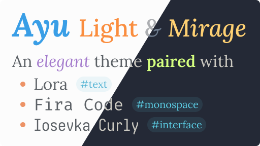
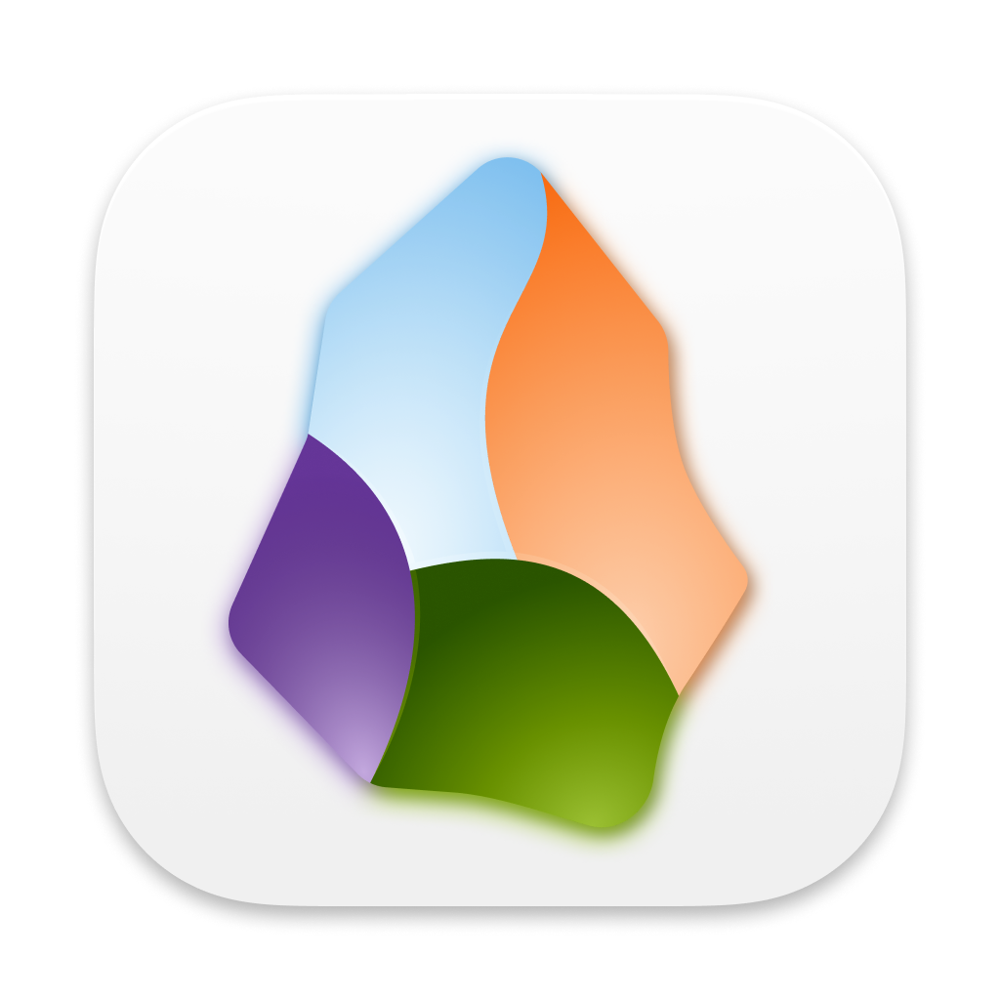
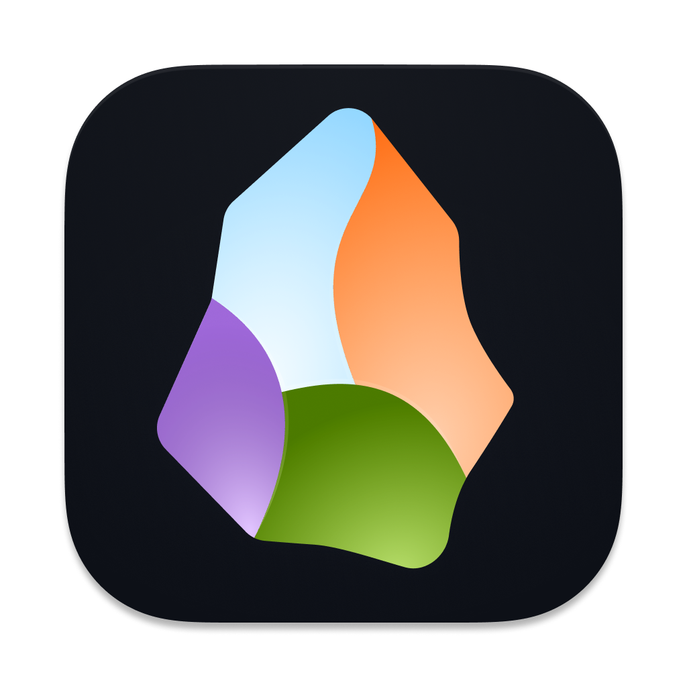
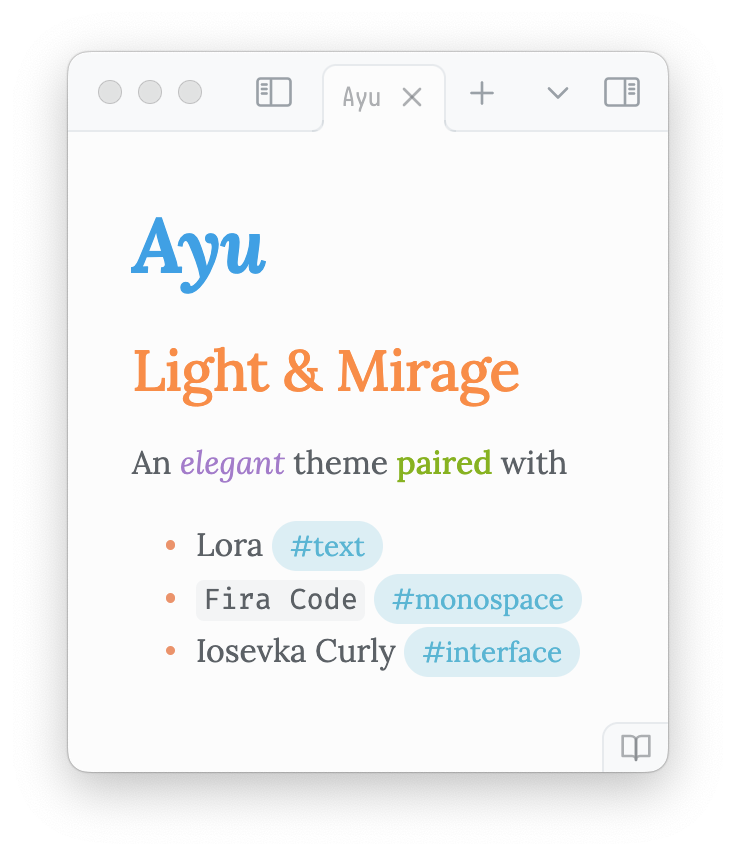
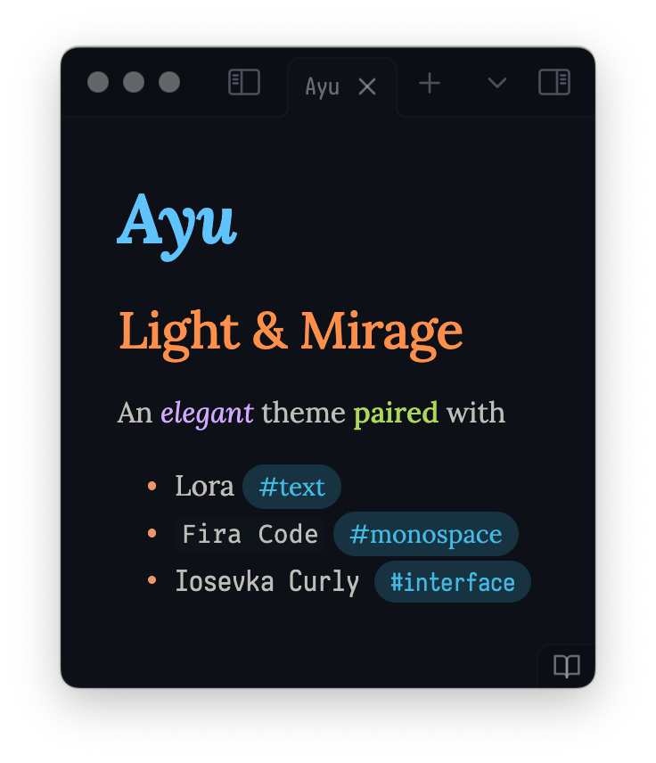

**Ayu Obsidian** is an [Ayu](https://github.com/ayu-theme) adaptation for [Obsidian](https://obsidian.md/) paired with a font selection.



Like it?

<a href="https://www.buymeacoffee.com/taronull" target="_blank">
	
</a>

# Installation

1. [Download Obsidian](https://obsidian.md/download)
	- `brew install obsidian`
2. Open **Preferences** in Obsidian
	- Menu bar -> Obsidian -> Preferences...
	- `⌘` + `,`
3. Navigate to **Options**-**Appearance**
4. Find **Themes** section and click _Manage_
5. Filter for ***Ayu Light & Mirage***
6. Click _Install and use_

Or, manually download this repo in your `.obsidian/themes`

# Icons

<div style="display: flex; gap: 1rem">
	
	
	
</div>

Change your Obsidian app icon in **Options**-**Appearance**-**Advanced**-**Custom app icon**

# Colours

<div style="display: flex;">
	
	
	
</div>

Colours are applied based on Obsidian semantics and appearance on code editors.
Headings and indicators have warmer colours, while body emphasis are cooler.

This theme presents Ayu Light and Ayu Mirage by default.
You also have **Ayu Dark** in `theme.css` in case you want it.
Simply remove Mirage to apply.

```diff
  .theme-dark {
    /*
    Ayu Dark in RGBa
    */
    ...
  }

- .theme-dark {
-   /*
-   Ayu Mirage in RGBa
-   */
-   ...
- }
```

This adaptation is based on [Ayu Colors](https://github.com/ayu-theme/ayu-colors). The original theme is by [Ike](https://dempfi.com/).

# Fonts

Fonts are included in the `theme.css` as data URLs.

- [Lora](http://cyreal.org/fonts/lora/) by [Cyreal](http://cyreal.org/) for markdown editor text
- [Fira Code](https://firacode.org/) by [Niki](https://tonsky.me/) for fixed-width text
- [Iosevka Curly](https://typeof.net/Iosevka/) by [Renzhi Li](https://typeof.net/) for app interface
  - WOFF2 version from [Fontsource](https://fontsource.org/fonts/iosevka-curly)

# Versioning

1. Update `version` in `package.json` and `manifest.json`
2. Update `minAppVersion` in `manifest.json`
3. Add `<version>: <minAppVersion>` in `versions.json`
4. Add a `git tag -a <version> -m "<version>"`
5. `git push origin <version>` and hope for the best
