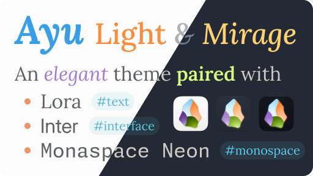

Ayu Obsidian is an [Ayu](https://github.com/ayu-theme) adaptation for [Obsidian](https://obsidian.md/) paired with a font selection.

# Ayu

The original theme is by [Ike](https://github.com/dempfi). Check out [Ayu](https://github.com/ayu-theme) for more. This adaptation is based on [Ayu Colors](https://github.com/ayu-theme/ayu-colors).

| Path                        | Light       | Mirage      | Dark        |
| --------------------------- | ----------- | ----------- | ----------- |
| `syntax.tag`                | `#55B4D4`   | `#5CCFE6`   | `#39BAE6`   |
| `syntax.func`               | `#F2AE49`   | `#FFD173`   | `#FFB454`   |
| `syntax.entity`             | `#399EE6`   | `#73D0FF`   | `#59C2FF`   |
| `syntax.string`             | `#86B300`   | `#D5FF80`   | `#AAD94C`   |
| `syntax.regexp`             | `#4CBF99`   | `#95E6CB`   | `#95E6CB`   |
| `syntax.markup`             | `#F07171`   | `#F28779`   | `#F07178`   |
| `syntax.keyword`            | `#FA8D3E`   | `#FFAD66`   | `#FF8F40`   |
| `syntax.special`            | `#E6BA7E`   | `#FFDFB3`   | `#E6B673`   |
| `syntax.comment`            | `#787B8099` | `#B8CFE680` | `#ACB6BF8C` |
| `syntax.constant`           | `#A37ACC`   | `#DFBFFF`   | `#D2A6FF`   |
| `syntax.operator`           | `#ED9366`   | `#F29E74`   | `#F29668`   |
| `vcs.added`                 | `#6CBF43`   | `#87D96C`   | `#7FD962`   |
| `vcs.modified`              | `#478ACC`   | `#80BFFF`   | `#73B8FF`   |
| `vcs.removed`               | `#FF7383`   | `#F27983`   | `#F26D78`   |
| `editor.fg`                 | `#5C6166`   | `#CCCAC2`   | `#BFBDB6`   |
| `editor.bg`                 | `#FCFCFC`   | `#242936`   | `#0D1017`   |
| `editor.line`               | `#8A91991A` | `#1A1F29`   | `#131721`   |
| `editor.selection.active`   | `#035BD626` | `#409FFF40` | `#409FFF4D` |
| `editor.selection.inactive` | `#035BD612` | `#409FFF21` | `#409FFF21` |
| `editor.findMatch.active`   | `#9F40FF2B` | `#695380`   | `#6C5980`   |
| `editor.findMatch.inactive` | `#9F40FFCC` | `#69538066` | `#6C598066` |
| `editor.gutter.active`      | `#8A9199CC` | `#8A9199CC` | `#6C7380E6` |
| `editor.gutter.normal`      | `#8A919966` | `#8A919966` | `#6C738099` |
| `editor.indentGuide.active` | `#8A919959` | `#8A919959` | `#6C738080` |
| `editor.indentGuide.normal` | `#8A91992E` | `#8A91992E` | `#6C738033` |
| `ui.fg`                     | `#8A9199`   | `#707A8C`   | `#565B66`   |
| `ui.bg`                     | `#F8F9FA`   | `#1F2430`   | `#0B0E14`   |
| `ui.line`                   | `#6B7D8F1F` | `#171B24`   | `#11151C`   |
| `ui.selection.active`       | `#56728F1F` | `#63759926` | `#47526640` |
| `ui.selection.normal`       | `#6B7D8F1F` | `#69758C1F` | `#47526633` |
| `ui.panel.bg`               | `#F3F4F5`   | `#1C212B`   | `#0F131A`   |
| `ui.panel.shadow`           | `#00000026` | `#12151CB3` | `#00000080` |
| `common.accent`             | `#FFAA33`   | `#FFCC66`   | `#E6B450`   |
| `common.error`              | `#E65050`   | `#FF6666`   | `#D95757`   |

# Fonts

- [Lora](http://cyreal.org/fonts/lora/) by [Cyreal](http://cyreal.org/)
- [Fira Code](https://firacode.org/) by [Niki](https://tonsky.me/)
- [Iosevka Curly](https://typeof.net/Iosevka/) by [Renzhi Li](https://typeof.net/)
  - WOFF2 version from [Fontsource](https://fontsource.org/fonts/iosevka-curly)
